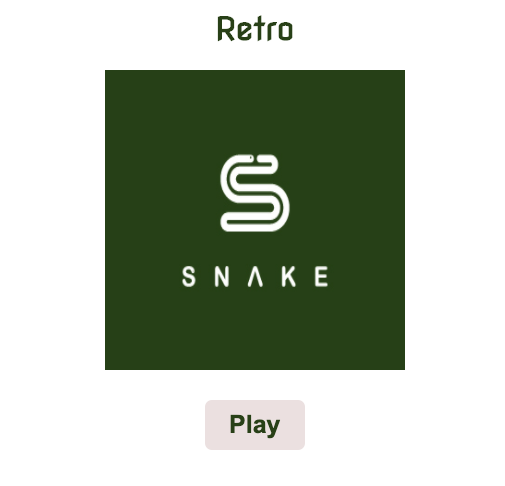
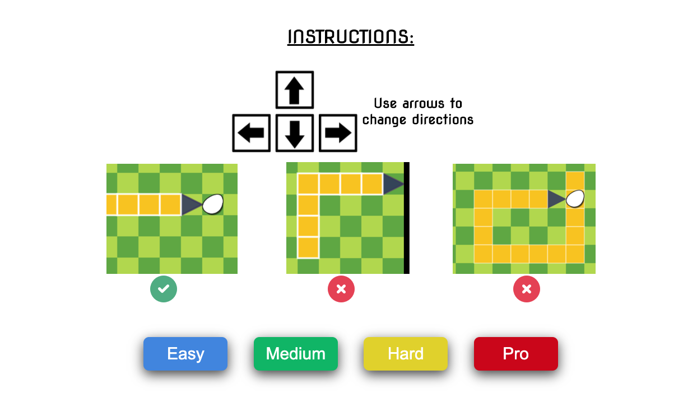

# RetroSnake

## Description

This is a recreation of the classic "Snake" game. Using HTML, CSS, and JavaScript, I was able to bring this classic game back to life with a few simple touch ups on sounds and effects.

[PLAY GAME!](https://jimmydla.github.io/RetroSnake/)

## Rules

## Authors

Names and contact info

[Jimmy De Los Angeles](https://www.linkedin.com/in/jimmydla/)

## License

This project is licensed under the MIT License - see the LICENSE.md file for details

## Acknowledgments

Inspiration:

- [Snake](https://playsnake.org/)
- [awesome-readme](https://github.com/matiassingers/awesome-readme)
